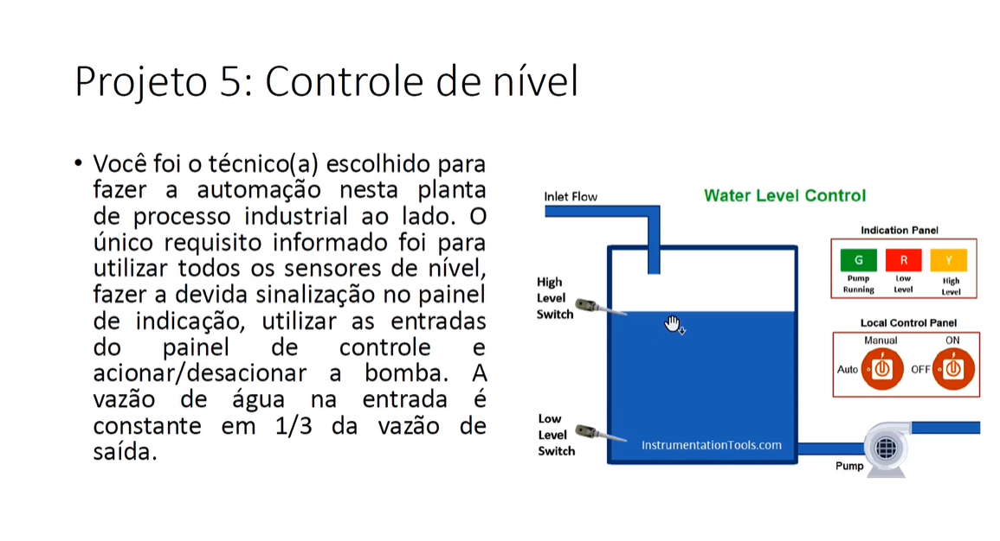
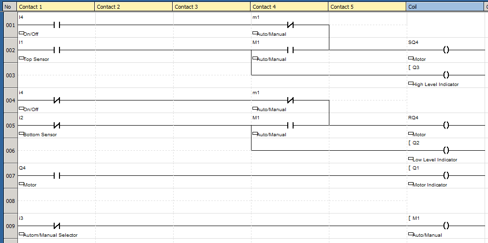
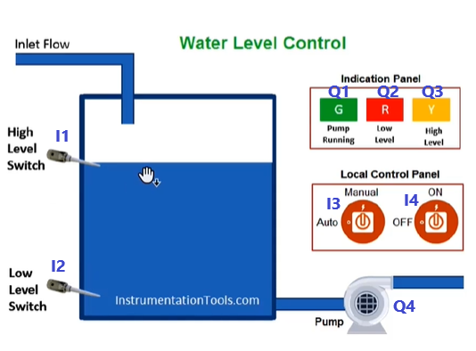

# 
 Level-Control 

## Goal

This is a Level Control project that I have created using ladder language as one of the projects required in the course [Treinamento em Lógica Ladder para CLP/PLC](https://www.udemy.com/course/treinamento-em-logica-ladder-para-plc/)

## Requirements 

The requirements to this project are described in the image bellow. 

## Implementation 

The program was created using ZelioSoft2 software, which is one of the software created by Schneider Electrics for Ladder programming on their Zelio series PLCs.

The ladder program is shown bellow

In this program I1 refers to the top sensor, I2 refers to the bottom sensor, I3 is the manual and automatic selector, I4 is the on/off motor selector, Q1 refers to the pump running indicator, Q2 refers to the low level indicator, Q3 refers to high level indicator, Q4 is the motor output.

The image below show these input and output associations.

## Notes and Concepts Learned  

First, I have created the automatic version and after that I put the manual and automatic selector  with on/off motor selector. I think this is a good way to approach and build the entire solution to the problem.  

